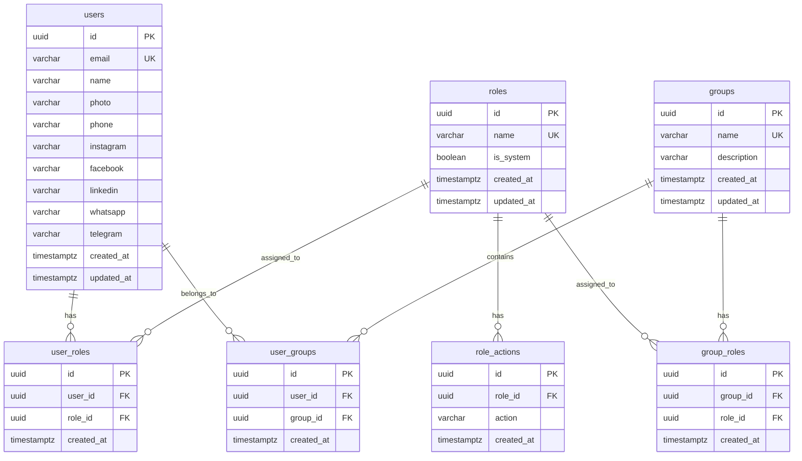

# Data Models

## Entity Relationship Diagram



## Schema: `user_manager`

All tables reside in the `user_manager` schema within the shared PostgreSQL instance.

### Table: `users`

| Column | Type | Constraints | Description |
|--------|------|-------------|-------------|
| `id` | `UUID` | PK, UUIDv7 | Unique identifier |
| `email` | `VARCHAR(255)` | NOT NULL, UNIQUE | Email from OAuth (immutable) |
| `name` | `VARCHAR(255)` | | Display name |
| `photo` | `TEXT` | | Photo URL |
| `phone` | `VARCHAR(30)` | | Phone number |
| `instagram` | `VARCHAR(100)` | | Instagram handle (without @) |
| `facebook` | `VARCHAR(255)` | | Facebook username or URL |
| `linkedin` | `VARCHAR(255)` | | LinkedIn username or URL |
| `whatsapp` | `VARCHAR(30)` | | WhatsApp phone number |
| `telegram` | `VARCHAR(100)` | | Telegram handle (without @) |
| `created_at` | `TIMESTAMPTZ` | NOT NULL, DEFAULT now() | Creation timestamp |
| `updated_at` | `TIMESTAMPTZ` | NOT NULL, DEFAULT now() | Last update timestamp |

### Table: `roles`

| Column | Type | Constraints | Description |
|--------|------|-------------|-------------|
| `id` | `UUID` | PK, UUIDv7 | Unique identifier |
| `name` | `VARCHAR(100)` | NOT NULL, UNIQUE | Role name |
| `is_system` | `BOOLEAN` | NOT NULL, DEFAULT false | System roles cannot be deleted |
| `created_at` | `TIMESTAMPTZ` | NOT NULL, DEFAULT now() | Creation timestamp |
| `updated_at` | `TIMESTAMPTZ` | NOT NULL, DEFAULT now() | Last update timestamp |

The `admin` role is seeded with `is_system = true`.

### Table: `role_actions`

| Column | Type | Constraints | Description |
|--------|------|-------------|-------------|
| `id` | `UUID` | PK, UUIDv7 | Unique identifier |
| `role_id` | `UUID` | NOT NULL, FK → roles(id) ON DELETE CASCADE | Parent role |
| `action` | `VARCHAR(100)` | NOT NULL | Action string (pattern: `[a-z0-9]+([:-][a-z0-9]+)*`) |
| `created_at` | `TIMESTAMPTZ` | NOT NULL, DEFAULT now() | Creation timestamp |

**Unique constraint:** `(role_id, action)` — no duplicate actions per role.

### Table: `groups`

| Column | Type | Constraints | Description |
|--------|------|-------------|-------------|
| `id` | `UUID` | PK, UUIDv7 | Unique identifier |
| `name` | `VARCHAR(100)` | NOT NULL, UNIQUE | Group name |
| `description` | `TEXT` | | Optional description |
| `created_at` | `TIMESTAMPTZ` | NOT NULL, DEFAULT now() | Creation timestamp |
| `updated_at` | `TIMESTAMPTZ` | NOT NULL, DEFAULT now() | Last update timestamp |

### Table: `user_roles`

| Column | Type | Constraints | Description |
|--------|------|-------------|-------------|
| `id` | `UUID` | PK, UUIDv7 | Unique identifier |
| `user_id` | `UUID` | NOT NULL, FK → users(id) ON DELETE CASCADE | User |
| `role_id` | `UUID` | NOT NULL, FK → roles(id) ON DELETE CASCADE | Directly assigned role |
| `created_at` | `TIMESTAMPTZ` | NOT NULL, DEFAULT now() | Assignment timestamp |

**Unique constraint:** `(user_id, role_id)` — no duplicate assignments.

### Table: `user_groups`

| Column | Type | Constraints | Description |
|--------|------|-------------|-------------|
| `id` | `UUID` | PK, UUIDv7 | Unique identifier |
| `user_id` | `UUID` | NOT NULL, FK → users(id) ON DELETE CASCADE | User |
| `group_id` | `UUID` | NOT NULL, FK → groups(id) ON DELETE CASCADE | Group membership |
| `created_at` | `TIMESTAMPTZ` | NOT NULL, DEFAULT now() | Assignment timestamp |

**Unique constraint:** `(user_id, group_id)` — no duplicate memberships.

### Table: `group_roles`

| Column | Type | Constraints | Description |
|--------|------|-------------|-------------|
| `id` | `UUID` | PK, UUIDv7 | Unique identifier |
| `group_id` | `UUID` | NOT NULL, FK → groups(id) ON DELETE CASCADE | Group |
| `role_id` | `UUID` | NOT NULL, FK → roles(id) ON DELETE CASCADE | Role assigned to group |
| `created_at` | `TIMESTAMPTZ` | NOT NULL, DEFAULT now() | Assignment timestamp |

**Unique constraint:** `(group_id, role_id)` — no duplicate role assignments per group.

## Indexes

| Table | Index | Columns | Purpose |
|-------|-------|---------|---------|
| `users` | `uq_users_email` | `email` | Unique lookup by email |
| `role_actions` | `idx_role_actions_role_id` | `role_id` | Fast action lookup by role |
| `user_roles` | `idx_user_roles_user_id` | `user_id` | Fast role lookup by user |
| `user_groups` | `idx_user_groups_user_id` | `user_id` | Fast group lookup by user |
| `group_roles` | `idx_group_roles_group_id` | `group_id` | Fast role lookup by group |

## Permission Resolution Query

The `/me` endpoint resolves permissions with a single query:

```sql
-- Resolved roles (direct + inherited from groups)
SELECT DISTINCT r.name
FROM user_manager.roles r
WHERE r.id IN (
    -- Direct roles
    SELECT ur.role_id FROM user_manager.user_roles ur WHERE ur.user_id = :userId
    UNION
    -- Inherited roles via groups
    SELECT gr.role_id FROM user_manager.group_roles gr
    JOIN user_manager.user_groups ug ON ug.group_id = gr.group_id
    WHERE ug.user_id = :userId
);

-- Flattened actions
SELECT DISTINCT ra.action
FROM user_manager.role_actions ra
WHERE ra.role_id IN (
    SELECT ur.role_id FROM user_manager.user_roles ur WHERE ur.user_id = :userId
    UNION
    SELECT gr.role_id FROM user_manager.group_roles gr
    JOIN user_manager.user_groups ug ON ug.group_id = gr.group_id
    WHERE ug.user_id = :userId
);
```

## Liquibase Strategy

- **Schema:** `user_manager`
- **Changelog tracking table:** `user_manager.databasechangelog` (isolated from other services)
- **Configuration:**
  ```yaml
  # application.yaml
  quarkus:
    liquibase:
      default-schema-name: user_manager
      liquibase-schema: user_manager
      migrate-at-start: true
  ```
- **Initial migration:** Uses `CREATE SCHEMA IF NOT EXISTS` and `CREATE TABLE IF NOT EXISTS` for idempotency
- **Seed data:** Predefined `admin` role with `is_system = true`
- **No cross-schema FKs:** This service does not reference other schemas

## Database User

```sql
CREATE USER user_manager_svc WITH PASSWORD '...';
GRANT ALL ON SCHEMA user_manager TO user_manager_svc;
ALTER DEFAULT PRIVILEGES IN SCHEMA user_manager GRANT ALL ON TABLES TO user_manager_svc;
ALTER DEFAULT PRIVILEGES IN SCHEMA user_manager GRANT ALL ON SEQUENCES TO user_manager_svc;
```
