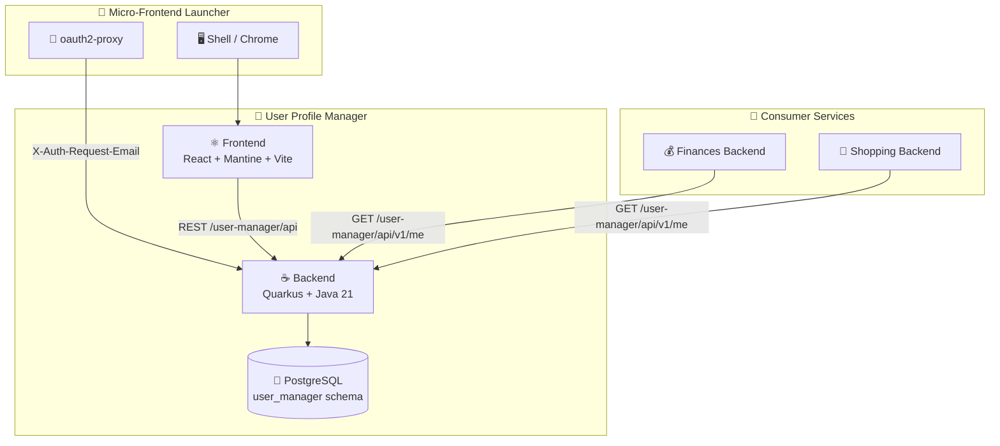
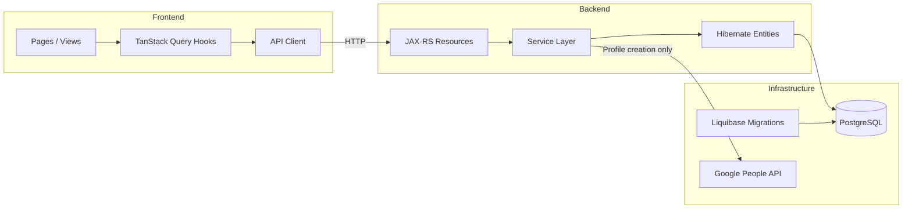

# Design Index

## Architecture Overview

User Profile Manager is a micro-frontend application composed of a Java/Quarkus backend API and a React/Mantine frontend, loaded by the micro-frontend-launcher shell. It provides user profile management and RBAC for all applications in the platform.

## Pages

| Page | Description |
|------|-------------|
| [adrs.md](adrs.md) | Architecture Decision Records |
| [data-models.md](data-models.md) | Database schema and entity relationships |
| [rest-architecture.md](rest-architecture.md) | REST API design and endpoints |
| [frontend-architecture.md](frontend-architecture.md) | Frontend structure, routing, and component design |
| [test-scenarios.md](test-scenarios.md) | Test scenarios validating requirements |

## Component Interaction

## Key Design Decisions

| ADR | Decision | Status |
|-----|----------|--------|
| [ADR-1](adrs.md#adr-1-quarkus-with-java-21) | Quarkus with Java 21 | Accepted |
| [ADR-2](adrs.md#adr-2-resteasy-reactive) | RESTEasy Reactive | Accepted |
| [ADR-3](adrs.md#adr-3-hibernate-orm-with-panache) | Hibernate ORM with Panache | Accepted |
| [ADR-4](adrs.md#adr-4-liquibase-for-migrations) | Liquibase for migrations | Accepted |
| [ADR-5](adrs.md#adr-5-proxy-trust-authentication) | Proxy-trust authentication | Accepted |
| [ADR-6](adrs.md#adr-6-schema-isolation-strategy) | Schema isolation strategy | Accepted |
| [ADR-7](adrs.md#adr-7-uuidv7-for-primary-keys) | UUIDv7 for primary keys | Accepted |
| [ADR-8](adrs.md#adr-8-react-mantine-vite-frontend) | React + Mantine + Vite frontend | Accepted |
| [ADR-9](adrs.md#adr-9-gradle-kotlin-dsl-build) | Gradle Kotlin DSL build | Accepted |
| [ADR-10](adrs.md#adr-10-quarkus-container-image-extension) | Quarkus Container Image Extension | Accepted |

## Cross-Cutting Concerns

| Concern | Approach |
|---------|----------|
| Authentication | Trusts `X-Auth-Request-Email` header from oauth2-proxy (NFR-1) |
| Authorization | Admin role checked via service layer; enforced per endpoint |
| Error Handling | RFC 7807 Problem Detail for all errors |
| Logging | Structured JSON, correlation via request ID |
| Configuration | Environment variables, Quarkus `application.yaml` |
| Health Checks | Quarkus SmallRye Health (`/q/health`) |
